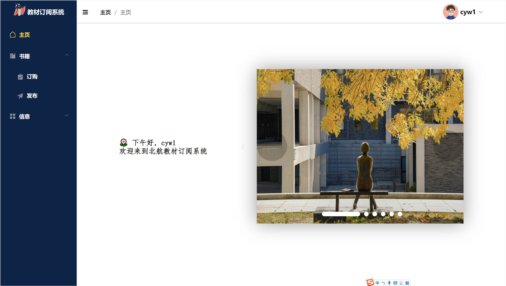
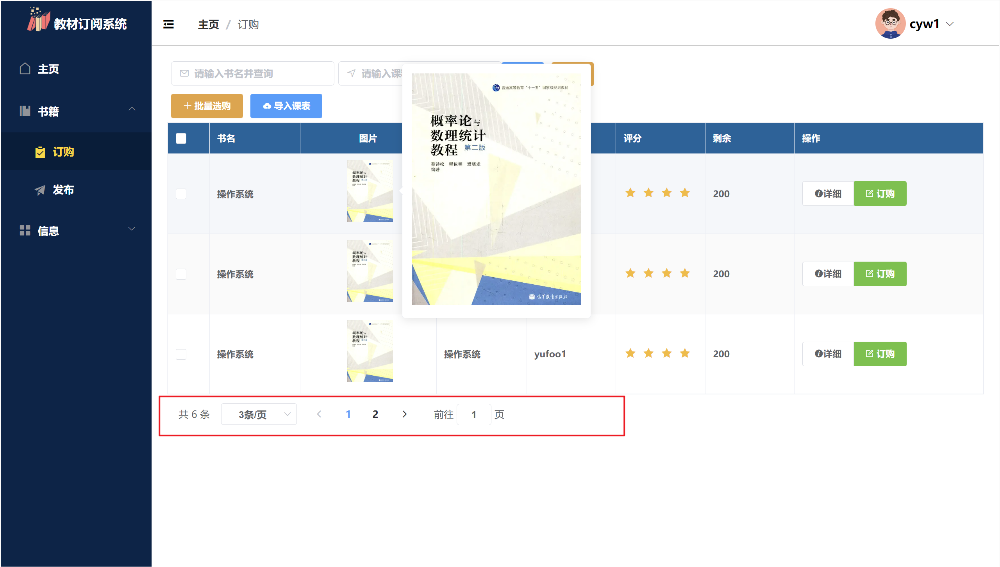
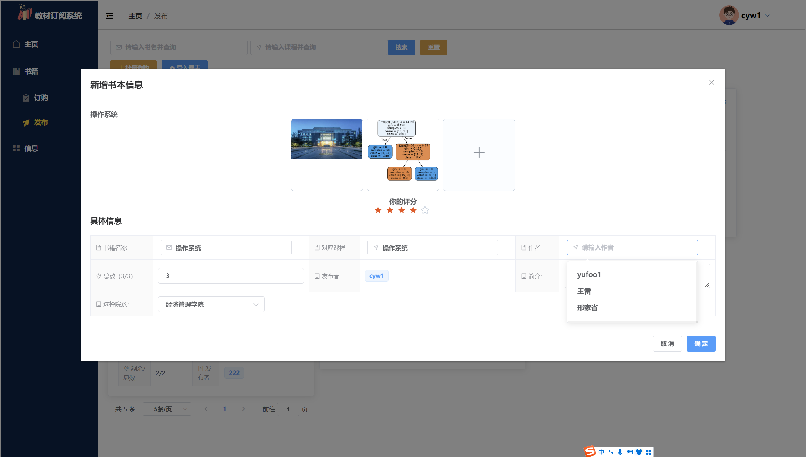
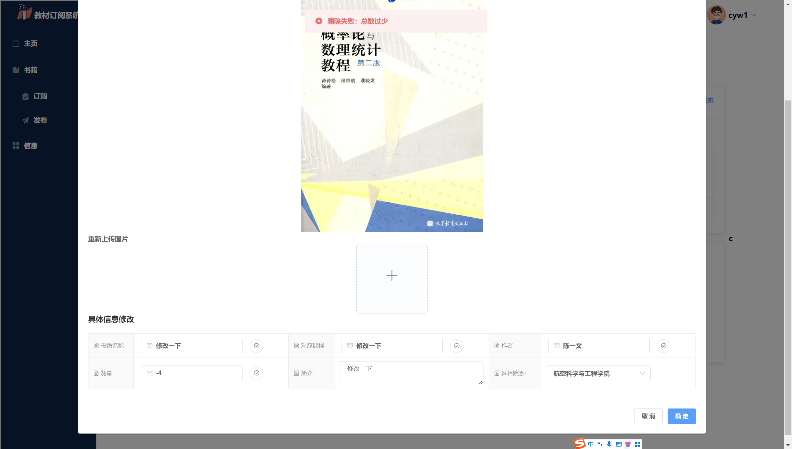
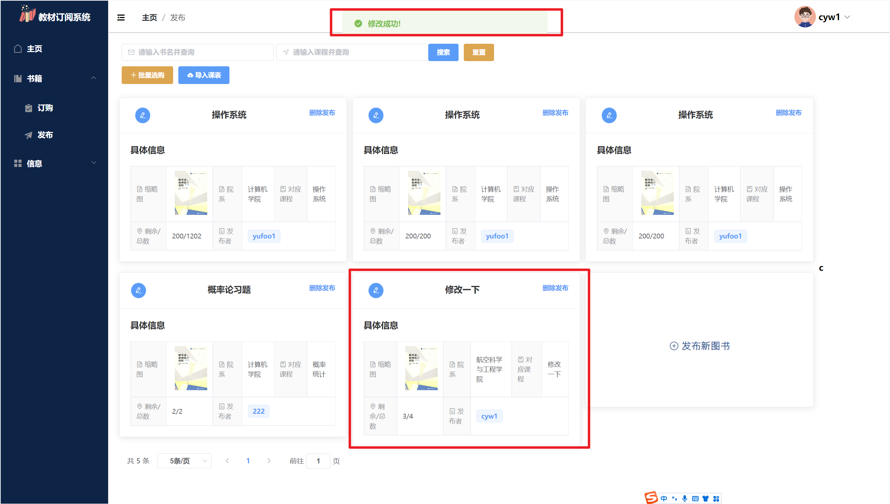
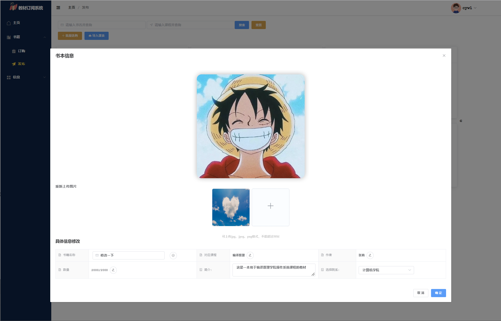

## DedeKet_front

frontend of web project [dedeket](https://github.com/yufoo1/Dedeket)

|  |  |
| ------------------------------------------------------------ | ------------------------------------------------------------ |
|  |  |
|  |  |

| .png) |
| ------------------------------------------------------------ |
| .png) |


## Project setup
```
npm install
```

### Compiles and hot-reloads for development
```
npm run serve
```

### Compiles and minifies for production
```
npm run build
```

### Customize configuration
See [Configuration Reference](https://cli.vuejs.org/config/).
